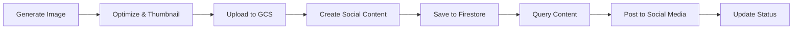

# Content Generation & Social Media Workflow

Complete workflow for generating AI content and posting to social media platforms.

## 📋 Quick Start

### 1. Generate & Store Content

```bash
python examples/generate_and_store_cartoon.py
```

**What it does:**
- ✅ Generates AI image using Vertex AI Imagen
- ✅ Optimizes image for web (PNG, 1024x1024)
- ✅ Creates thumbnail (300x300)
- ✅ Uploads to Google Cloud Storage
- ✅ Saves metadata & social content to Firestore

**Output:**
- Main image: `gs://your-bucket/cartoons/robot_character.png`
- Thumbnail: `gs://your-bucket/cartoons/thumbnails/robot_character.png`
- Firestore document with complete metadata

---

### 2. Query & View Content

```bash
python examples/query_and_post_content.py
```

**What it does:**
- ✅ Queries Firestore for ready-to-post content
- ✅ Displays image URLs
- ✅ Shows pre-written social media captions
- ✅ Lists hashtags and posting status

---

## 📊 Data Structure

### Google Cloud Storage
```
your-bucket/
├── cartoons/
│   ├── robot_character.png          (main image)
│   └── thumbnails/
│       └── robot_character.png      (300x300 thumbnail)
```

### Firestore Document Structure
```javascript
{
  content_id: "cartoon_20251227_182247",
  content_type: "image",
  category: "cartoon",
  status: "ready_to_post",
  
  // Generation details
  generation: {
    prompt: "A cheerful cartoon character...",
    model: "imagen-3.0-generate-001",
    aspect_ratio: "1:1",
    cost_usd: 0.02,
    generated_at: "2025-12-27T18:22:47"
  },
  
  // Storage URLs
  storage: {
    gcs_bucket: "datalogichub-learning-bucket-2025",
    main_image: {
      url: "https://storage.googleapis.com/.../robot_character.png",
      path: "cartoons/robot_character.png",
      size_bytes: 624055,
      format: "png"
    },
    thumbnail: {
      url: "https://storage.googleapis.com/.../thumbnails/robot_character.png",
      path: "cartoons/thumbnails/robot_character.png",
      size_bytes: 73967,
      format: "png"
    }
  },
  
  // Image properties
  image_properties: {
    width: 1024,
    height: 1024,
    mode: "RGB",
    dimensions: "1024x1024"
  },
  
  // Ready-to-use social media content
  social_media: {
    caption: "🤖 Meet our friendly robot character! ...",
    description: "Generated using AI: ...",
    hashtags: ["#AIArt", "#CartoonArt", "#RobotCharacter", ...],
    post_text: "🎨 Fresh AI-generated artwork!\n\nCheck out..."
  },
  
  // Track posting status across platforms
  posting_status: {
    facebook: "pending",
    instagram: "pending",
    twitter: "pending",
    linkedin: "pending"
  },
  
  // Metadata
  tags: ["cartoon", "robot", "ai-generated", "social-media-ready"],
  created_at: "2025-12-27T18:22:47",
  updated_at: "2025-12-27T18:22:47"
}
```

---

## 🔄 Complete Workflow



### Step-by-Step:

1. **Generate**: Run `generate_and_store_cartoon.py`
   - AI creates image ($0.02)
   - Stored in GCS + Firestore

2. **Query**: Run `query_and_post_content.py`
   - Fetch content from Firestore
   - Get image URLs and captions

3. **Post**: Use social media APIs
   - Facebook Graph API
   - Instagram Graph API
   - Twitter API v2
   - LinkedIn API

4. **Update**: Mark as posted
   ```python
   firestore_manager.collection.document(doc_id).update({
       'posting_status.facebook': 'posted',
       'posting_status.facebook_posted_at': datetime.now().isoformat()
   })
   ```

---

## 🎨 Customization

### Change Image Prompt
Edit `generate_and_store_cartoon.py` line 61:
```python
cartoon_prompt = "Your custom prompt here..."
```

### Change Aspect Ratio
Line 69:
```python
aspect_ratio="16:9"  # or "1:1", "4:3", "9:16"
```

### Change Storage Path
Line 141:
```python
main_path = "your-folder/your-filename.png"
```

### Customize Social Content
Line 183-209 in `generate_and_store_cartoon.py`

---

## 📱 Next Steps: Social Media Integration

### Facebook/Instagram
```python
import requests

# Get content from Firestore
content = firestore_manager.get_document(doc_id)

# Post to Facebook
response = requests.post(
    f'https://graph.facebook.com/v18.0/{page_id}/photos',
    data={
        'url': content['storage']['main_image']['url'],
        'caption': content['social_media']['post_text'],
        'access_token': facebook_access_token
    }
)
```

### Twitter (X)
```python
import tweepy

client = tweepy.Client(bearer_token=twitter_bearer_token)

# Upload media
media = client.create_media(
    file=content['storage']['main_image']['url']
)

# Post tweet
client.create_tweet(
    text=content['social_media']['post_text'],
    media_ids=[media.media_id]
)
```

---

## 💰 Cost Tracking

Each generated image costs **$0.02** (Vertex AI Imagen pricing).

Storage costs: ~$0.02/GB/month (GCS standard storage).

Firestore: Free tier includes 1GB storage + 50K reads/day.

---

## 🔍 Query Examples

### Find all pending posts
```python
docs = collection.where('status', '==', 'ready_to_post').stream()
```

### Find content by tag
```python
docs = collection.where('tags', 'array_contains', 'cartoon').stream()
```

### Find content by date range
```python
from datetime import datetime, timedelta

yesterday = (datetime.now() - timedelta(days=1)).isoformat()
docs = collection.where('created_at', '>', yesterday).stream()
```

---

## 📚 Files Created

1. **`generate_and_store_cartoon.py`** - Main content generation script
2. **`query_and_post_content.py`** - Query and display content
3. **Updated `firestore.py`** - Added `create_document()` method
4. **Updated `storage_manager.py`** - Graceful signed URL handling

---

## ✅ Summary

You now have:
- ✅ AI image generation with Vertex AI
- ✅ Cloud Storage for media files
- ✅ Firestore for metadata & social content
- ✅ Pre-written social media captions & hashtags
- ✅ Query system to find ready-to-post content
- ✅ Status tracking across platforms

**Ready to scale to any social media platform!** 🚀
